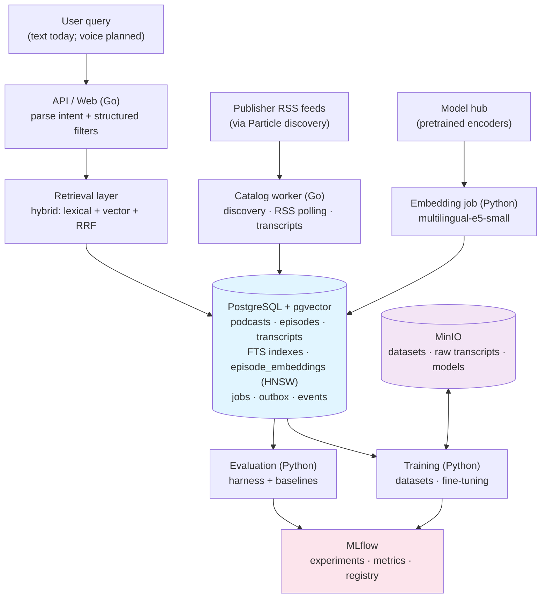
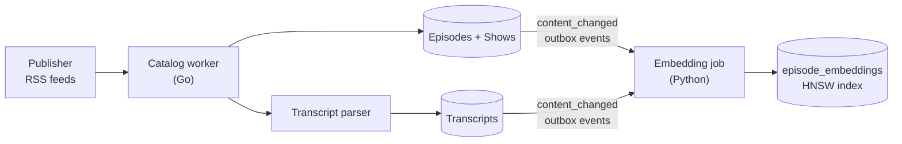
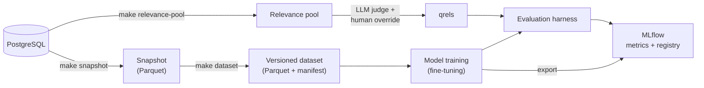
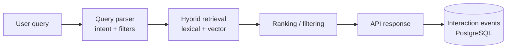
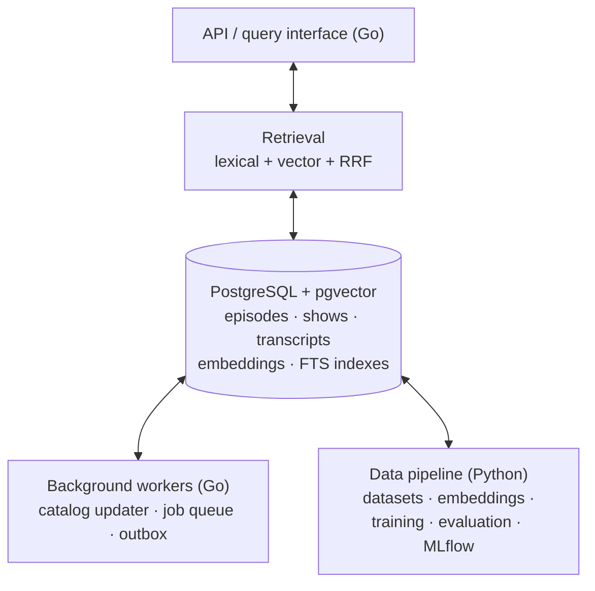

# Architecture

PodFind is a distributed system split between Python (ML and data) and Go (ingestion and serving), with PostgreSQL as the central data store.

## System Overview

## Component Layers

### 1. Data Ingestion & Catalog (Go)

**Responsible:** RSS polling, transcript parsing, catalog maintenance

- **catalog worker:** Maintains a self-updating podcast catalog
  - Discovers new shows via RSS feeds
  - Polls existing feeds for new episodes (adaptive scheduling)
  - Stores metadata (show name, episode title, publish date, duration, explicit flag)
  - Requests transcript parsing for episodes with transcripts available

- **RSS parser:** Handles feed parsing, deduplication, and error recovery
  - Supports multiple feed formats and transcript sources
  - Deduplicates by GUID and enclosure URL
  - Validates feed structure and handles malformed feeds gracefully

- **Transcript parser:** Extracts text from published transcripts
  - Parses multiple transcript formats (Podtrac, Rev, etc.)
  - Associates transcript text with episodes
  - Stores in PostgreSQL for full-text indexing

### 2. Embeddings & Vector Indexing (Go + ML)

**Responsible:** Generating and maintaining vector search indexes

- **Embedding job (Python today; Go orchestration planned):**
  - Runs sentence-transformers inference in batches (resumable; re-embeds
    on content change via content hashes)
  - Stores vectors in PostgreSQL pgvector, keyed by (episode, model)

- **Embedding models (ML):** Fine-tuned or pretrained embedding models
  - Current: `intfloat/multilingual-e5-small` (384-dim)
  - Evaluate: larger models (e5-base, BGE) for quality
  - Versioned in experiments for reproducibility

### 3. Retrieval Layer (Go)

**Responsible:** Searching across lexical and vector indexes

- **Hybrid retrieval:** Combines three strategies
  - **Lexical:** BM25 via PostgreSQL full-text search (FTS)
  - **Vector:** cosine-distance ANN search over pgvector embeddings
  - **RRF (Reciprocal Rank Fusion):** Merges lexical + vector rankings

- **Filtering & ranking:** 
  - Hard constraints: language, duration, published date, explicit flag
  - Soft scoring: popularity, recency, relevance confidence
  - Future: learned reranker (two-tower model)

- **Query parsing (Go):**
  - Extract intent from free-text or voice queries
  - Identify structured filters (language, duration, etc.)
  - Generate embeddings for semantic search

### 4. Data Pipeline & Training (Python)

**Responsible:** Creating versioned datasets and training models

- **Snapshots:** Point-in-time database dumps
  - Captures catalog state + transcripts
  - Used as baseline for dataset building
  - Versioned in `data/snapshots/`

- **Datasets:** Versioned training/eval data
  - Built from snapshots + relevance judgments
  - Schema validation with Pandera
  - Exported to Parquet for reproducibility

- **Relevance judgments:** Human-labeled relevance set
  - Graded judgments (relevant, somewhat-relevant, not-relevant)
  - Multiple queries per system (lexical, vector, hybrid, popularity)
  - Pooling: combining results from multiple retrieval systems
  - Future: LLM-assisted judging for scale

### 5. Evaluation (Python)

**Responsible:** Measuring retrieval quality

- **Metrics:** Computed per query and aggregated
  - Recall@K: Percentage of relevant docs retrieved
  - MRR (Mean Reciprocal Rank): Quality of first relevant result
  - NDCG (Normalized Discounted Cumulative Gain): Ranked quality
  - Coverage: % of episodes with good match
  - Latency: Query response time

- **Experiment framework:**
  - Checked-in configs for reproducibility
  - Tracks which models/snapshots were used
  - Logs to MLflow for comparison

- **Comparison harness:**
  - Evaluates multiple configs in one run
  - Generates detailed reports
  - Visualizes metric differences

### 6. Data Storage (PostgreSQL + MinIO)

**PostgreSQL:**
- **Episodes:** ID, title, description, transcript text, language, duration, publish date, explicit flag
- **Shows:** ID, title, RSS URL, category, language, metadata
- **Vectors:** pgvector columns for episode embeddings
- **Indexes:** FTS for lexical search, pgvector indices for approximate NN search
- **Full text search:** Multilingual stemming, stop word handling

**MinIO:**
- Stores embedding vectors as serialized numpy arrays (future: compressed binary)
- Stores large training datasets (Parquet)
- Stores experiment reports and detailed eval results

## Data Flow

### Ingestion Pipeline

### Training Pipeline

### Serving Pipeline

## Key Design Decisions

### Python + Go Split

- **Go:** Low-latency serving, background workers, minimal dependencies
- **Python:** ML libraries (torch, transformers), data processing (pandas, pyarrow)
- **Data bridge:** PostgreSQL + MinIO; both languages read/write to same tables

### PostgreSQL + pgvector as Sole Index

- Operational simplicity: single database to manage, backup, scale
- No separate vector DB (Pinecone, Weaviate) reduces complexity
- Trade-off: vector search less optimized than specialized engines, but sufficient for catalog scale (~800k episodes)

### Versioned Datasets & Snapshots

- Reproducibility: any snapshot can rebuild any dataset bit-for-bit
- Audit trail: track which data version was used in which experiment
- No "latest dataset": explicitly specify version in experiment config

### Relevance Judgments Over Synthetic Labels

- Human judgments ground ground truth
- LLM-assisted labeling for scale (future)
- Pooling from multiple retrieval systems prevents bias toward any single approach

## Dependencies & Data Flow Diagram

## Scalability Notes

- **Catalog scale:** ~1,800 shows, ~800k episodes fits comfortably in PostgreSQL
- **Vector index:** pgvector with HNSW or IVFFlat index handles search at this scale
- **Embedding generation:** Batch processing via workers; can parallelize across episodes
- **Training:** Datasets in Parquet; models fit in GPU memory
- **Serving:** API server can scale horizontally; PostgreSQL becomes bottleneck at higher QPS

For deployment at larger scale, consider:
- Dedicated vector database (Milvus, QdrantDB)
- Read replicas for PostgreSQL
- Caching layer (Redis) for frequent queries
- Async job queue (Bull, Celery) for background work
