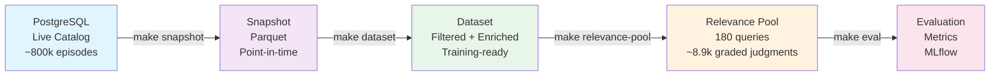
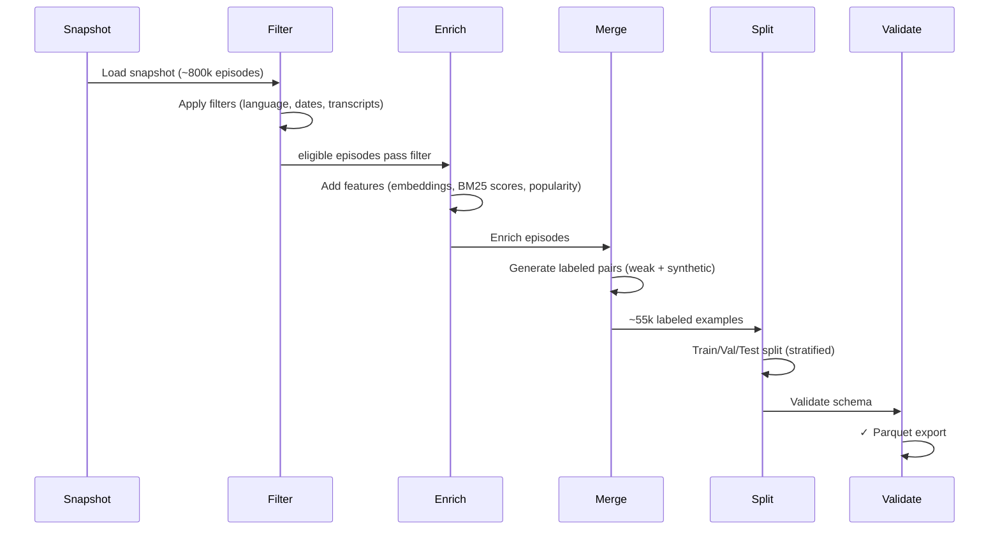
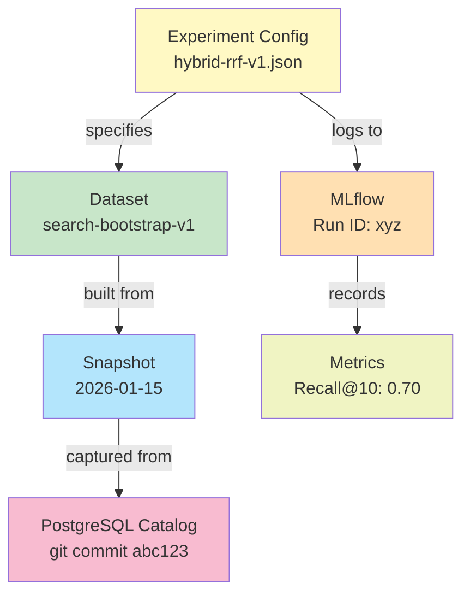
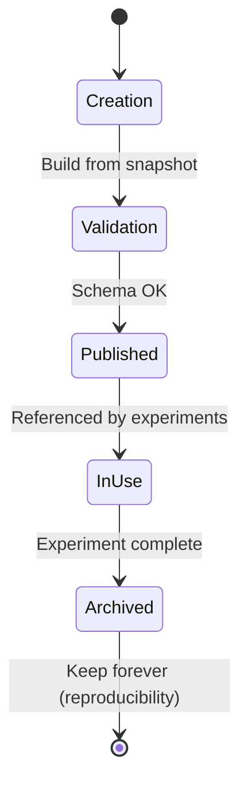

# Data Pipeline: Snapshots, Datasets & Versioning

The data pipeline ensures reproducible, auditable ML workflows by versioning snapshots and datasets.

## Data Pipeline Flow



## Snapshots: Point-in-Time Captures

**Purpose**: Immutable database snapshot for reproducible dataset building.

### Key Properties

| Property | Benefit |
|----------|---------|
| **Immutable** | Never modified; new data = new version |
| **Self-contained** | No live DB dependency for dataset building |
| **Auditable** | Links experiment → dataset → catalog state |
| **Versionable** | Checked in; fully reproducible from git |

**Create snapshot:**
```bash
make snapshot
```

**Output**: Parquet files + metadata.json (timestamp, row counts, git commit)

### Snapshot Retention
- Keep: Snapshots used in published experiments (indefinitely)
- Archive: Older snapshots to S3 (after 6 months)
- Cleanup: Development snapshots (rolling 2-week window)

## Datasets: Versioned Training & Eval Data

**Purpose**: Apply filters, enrich features, and join with relevance judgments.

### Dataset Construction Steps



### Configuration & Build

Specify dataset via config file (checked in):
```bash
experiments/datasets/search-bootstrap-v1.json
```

Build:
```bash
make dataset CONFIG=experiments/datasets/search-bootstrap-v1.json
```

**Output**: train.parquet, val.parquet, test.parquet (+ metadata.json)

### Features Added

| Feature Type | Examples |
|--------------|----------|
| **Query** | Intent, embedding, difficulty |
| **Episode** | Title, description, transcript, embedding |
| **Signals** | BM25 score, vector similarity, popularity |
| **Labels** | Relevance grade (human-judged) |

### Validation

Schema validation via Pandera:
- Column presence & types
- Value constraints (duration > 0, language in {en, es, fr})
- Null handling
- Fails loudly on violations

## Experiment-Config Lineage

Every experiment references exact versions:



**Reproducibility**: Can re-run any historical experiment by specifying snapshot + config + git commit.

## Dataset Lifecycle



**Strategy**:
- Meaningful versioning: `search-bootstrap-v1` (not by date)
- Never overwrite versions
- Archive: Keep indefinitely (disk is cheap)
- Track row counts: Before/after at each filter step

## Best Practices

✓ **Version by content** (search-bootstrap-v1), not date  
✓ **Document filters** in config (explain exclusions)  
✓ **Validate schema** with Pandera (fail loud on mismatches)  
✓ **Commit configs** to git (part of reproducible artifact)  
✓ **Track lineage** (snapshot → dataset → experiment → metrics)  

✗ **Don't overwrite** dataset versions  
✗ **Don't delete** published datasets (breaks reproducibility)  

## Future Enhancements

- Incremental snapshots (faster delta updates)
- MLflow dataset versioning (automatic lineage UI)
- Feature caching (avoid recomputing embeddings)
