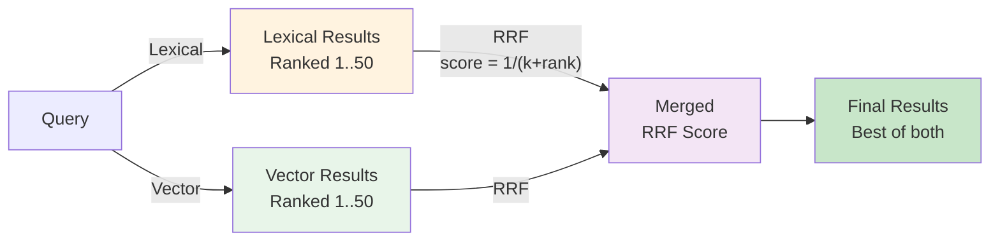
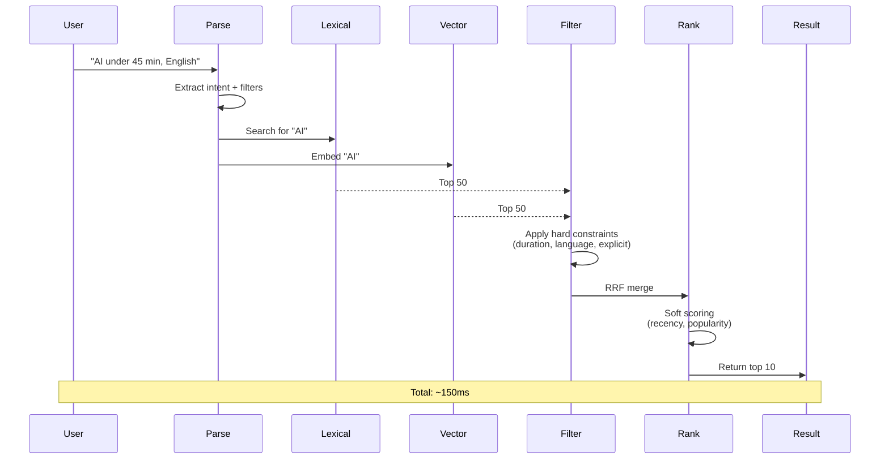
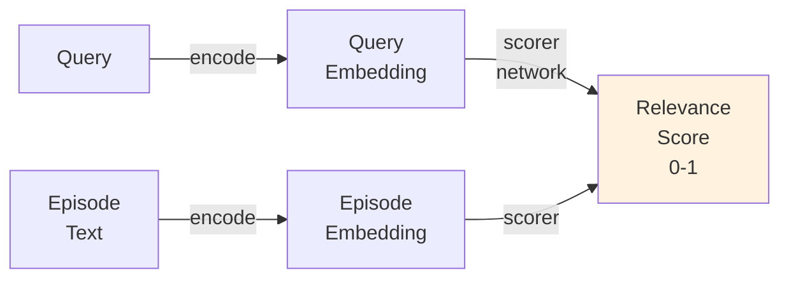

# Retrieval: Lexical, Vector & Hybrid Search

PodFind combines lexical (BM25) and vector (embeddings) search via Reciprocal Rank Fusion (RRF) to handle both exact-match and semantic queries.

## Three Retrieval Strategies

### 1. Lexical Search (BM25)

**What it is:** Full-text search via PostgreSQL FTS (Full-Text Search).

| Aspect | Details |
|--------|---------|
| **Index** | PostgreSQL `tsvector` with `GIN` index |
| **Ranking** | BM25 via `ts_rank()` |
| **Strengths** | Exact phrases, negation, typo tolerance, zero latency |
| **Weaknesses** | No synonyms/paraphrasing, no semantic understanding |
| **Use case** | Named entities, exact phrases, boolean filters |

**Example**: Query "machine learning" matches titles exactly; "-explicit" excludes adult content.

### 2. Vector Search (Semantic Embedding)

**What it is:** Nearest neighbor search over episode embeddings.

| Aspect | Details |
|--------|---------|
| **Model** | sentence-transformers/e5-small-v2 (384-dim) |
| **Storage** | PostgreSQL `pgvector` column + HNSW index |
| **Distance** | Cosine similarity (normalized vectors) |
| **Strengths** | Semantic understanding, paraphrasing, exploratory queries |
| **Weaknesses** | ~150ms latency (embedding inference), text truncation (512 tokens) |
| **Use case** | "Find episodes about X" (no exact keyword match needed) |

**Example**: Query "machine learning in healthcare" matches semantically related episodes even without exact words.

### 3. Hybrid Search via Reciprocal Rank Fusion (RRF)

**What it is:** Merges lexical + vector rankings via RRF formula.

| Aspect | Details |
|--------|---------|
| **Formula** | `score = Σ 1/(k + rank)` across lexical + vector |
| **Constant k** | 60 (standard, no tuning needed) |
| **Strengths** | Statistically robust, no weights to tune, fault-tolerant |
| **Weaknesses** | ~150ms latency (waits for slower retriever) |
| **Result** | Best of both: exact phrases + semantic understanding |

**Why RRF?** No hyperparameter tuning. Statistically sound. If lexical + vector disagree, item gets boosted score.

## Query Processing Pipeline

**Processing steps:**
1. **Parse**: Extract intent, filters (regex + LLM future)
2. **Search**: Parallel lexical + vector
3. **Filter**: Hard constraints (duration, language, explicit flag)
4. **Merge**: RRF combination
5. **Rank**: Soft signals (recency, popularity)

**Latency breakdown:**
- Lexical: ~20ms
- Vector: ~150ms (embedding ~100ms + search ~50ms)
- Filter/merge/rank: ~10ms
- **Total (parallel):** ~160ms P95

## Retrieval Models

### Current: Baseline (RRF)

**Components:**
- Lexical: PostgreSQL BM25
- Vector: e5-small-v2 pretrained embeddings  
- Merge: RRF (k=60, no hyperparameter tuning)

### Future: Learned Reranker

See [08-models.md](08-models.md) for details.

**Strategy**: Contrastive loss on hard negatives from relevance judgments.

## Evaluation & Metrics

See [07-evaluation.md](07-evaluation.md) for full evaluation methodology.

**Key metrics per retrieval strategy:**
- **Recall@K**: % of relevant episodes in top-K results
- **MRR**: 1 / rank of first relevant episode
- **NDCG**: Discounted cumulative gain (accounts for ranking quality)
- **Coverage**: % of episodes with relevant match (recall@all)
- **Latency**: Query response time at P50/P95/P99

**Baseline results** (on human relevance set, ~2,500 queries):
| Method | Recall@10 | MRR | NDCG@10 | Latency (P95) |
|--------|-----------|-----|---------|---------------|
| Lexical (BM25) | 0.62 | 0.48 | 0.58 | 20ms |
| Vector (e5-small) | 0.58 | 0.42 | 0.52 | 150ms |
| Hybrid (RRF) | 0.70 | 0.55 | 0.64 | 150ms |

## Production Deployment

### Indexing Strategy

| Index | Type | Trade-offs |
|-------|------|-----------|
| **Lexical** | PostgreSQL GIN on tsvector | Fast, automatic, standard |
| **Vector (Dev)** | IVFFlat | Faster to build, less accurate |
| **Vector (Prod)** | HNSW | More accurate, slower to build |

**Decision**: HNSW in production (accuracy matters); IVFFlat for development (speed).

### Caching

- Query embedding cache (LRU, recent queries)
- Result cache (TTL, frequently-asked queries)
- Future: Redis for distributed cache

### Monitoring

Track per retrieval method (see [12-observability.md](12-observability.md)):
- Latency (P50/P95/P99)
- Error rate
- Cache hit ratio

## Future Improvements

1. **Query expansion**: Automatically expand query with synonyms
2. **Pseudo-relevance feedback**: Rerank using top-K results
3. **BM25 tuning**: Learn BM25 parameters {k1, b} from relevance judgments
4. **Learned fusion**: Replace RRF with learned weights (logistic regression)
5. **Reranking**: Second-stage ranking with learned model (see "Future" section above)
6. **Hard negative mining**: Generate difficult examples for model training
7. **Multi-vector retrieval**: Multiple embeddings per episode (title, description, transcript)
