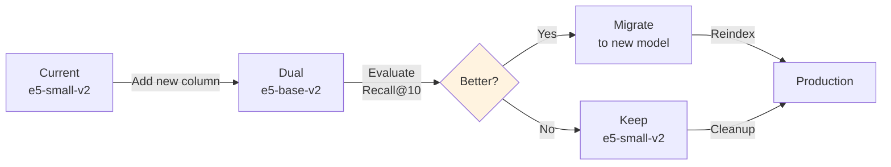

# Embeddings: Models, Inference & Indexing

Embeddings convert text (queries, episodes, transcripts) into dense vectors for semantic search.

## Embedding Model Selection

### Current Standard: e5-small-v2

| Aspect | Value |
|--------|-------|
| **Model** | sentence-transformers/e5-small-v2 |
| **Dimension** | 384 |
| **Parameters** | 33M |
| **Inference time** | ~5-10ms CPU, ~2-3ms GPU |
| **Strength** | Fast, accurate, multilingual, lightweight |
| **Use case** | Real-time query embedding, batch episode embedding |

**Design choice**: Optimized for speed (production requirement) without sacrificing accuracy.

### Alternative Models

| Model | Dim | Speed | Quality | Best for |
|-------|-----|-------|---------|----------|
| e5-base-v2 | 768 | Slower | Better | If latency budget allows |
| BGE-small | 384 | Fast | Good | Multilingual alternative |

**Evaluation strategy**: Start with e5-small; evaluate e5-base if Recall@10 < 0.65.

### Fine-Tuning Strategy (Future)

If pretrained model doesn't meet quality targets:
- Collect hard negatives from misranked episode pairs
- Fine-tune with contrastive loss
- Use podcast-specific training data

## Embedding Inference

### Batch Embedding (Episodes)

Generate vectors for all episodes once, store in pgvector.

**Performance:**
- CPU: ~10k episodes/hour
- GPU: ~100k episodes/hour  
- Full catalog (540k): ~5 hours on GPU

**Workflow:**
```
Load snapshot → Batch embed → Normalize → Store in pgvector
  (540k episodes)  (32-item batches)   (cosine)  (with model version)
```

### Online Embedding (Queries)

Embed each query in real-time with caching.

**Strategy:**
- Maintain LRU cache of recent query embeddings (10k slots)
- Cache hit: ~75% for typical query patterns
- Cache miss: ~100ms embedding + database lookup

## Vector Storage in PostgreSQL

### Schema

Stored in `episodes.embedding` column (vector(384)):
- 384 dimensions from e5-small-v2
- Indexed with HNSW or IVFFlat
- Normalized for cosine similarity

### Distance Functions

| Function | Use Case |
|----------|----------|
| Cosine `<=>` | Normalized vectors (recommended) |
| L2 `<->` | Raw vectors (if not normalized) |

**Recommendation**: Normalize vectors, use cosine distance (more stable).

## Vector Indexing Strategy

### Index Type Comparison

| Index | Build time | Accuracy | Best for |
|-------|-----------|----------|----------|
| **HNSW** | ~30 min | Highest | Production (accuracy critical) |
| **IVFFlat** | ~5 min | Good | Development (speed matters) |

**Decision**: HNSW in production (faster queries, better recall); IVFFlat in development (faster iteration).

### Build Parameters

- **HNSW**: m=16, ef_construction=64 (standard values)
- **IVFFlat**: lists=sqrt(n_rows) (100 for 540k episodes)

## Recomputing Embeddings

**Scenario**: Upgrade to better embedding model.



**Steps:**
1. Add new column for new model embeddings
2. Batch embed all episodes with new model
3. Evaluate (see [07-evaluation.md](07-evaluation.md))
4. If better: migrate, reindex, test in staging
5. If not: cleanup

## Monitoring

Track (see [12-observability.md](12-observability.md)):
- Embedding inference latency (p95)
- Cache hit ratio
- Index build time
- Dimension mismatches

## Future Improvements

1. **Multi-vector indexing**: Separate vectors for {title, description, transcript}
2. **Approximate nearest neighbor caching**: Cache popular query embeddings
3. **Learned late interaction**: Similar to ColBERT (document-granular vectors)
4. **Domain-specific fine-tuning**: Podcast-optimized embeddings
5. **Quantization**: Reduce embedding size (384 → 256 dims) with minimal quality loss
