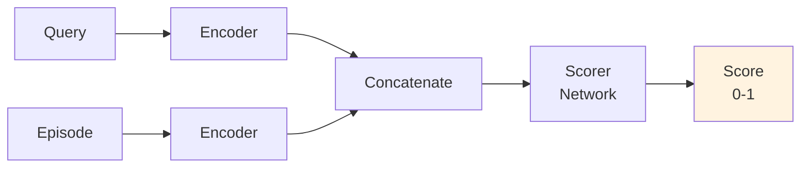
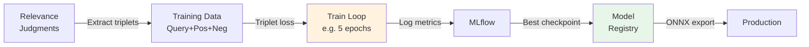
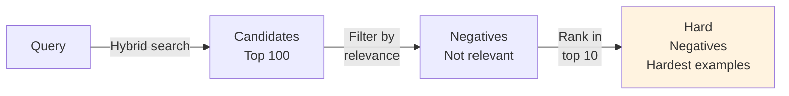

# Models: Training, Evaluation & Export

ML models power PodFind's semantic search and future reranking.

## Model Types

### Embedding Models (Current)

**Purpose**: Convert text to vectors for semantic search.  
**Current**: sentence-transformers/e5-small-v2 (384-dim)

See [05-embeddings.md](05-embeddings.md) for model details and inference strategy.

### Reranker Models (Future)

**Purpose**: Second-stage ranking to refine hybrid results.



**Training strategy**: Contrastive loss on positive/negative pairs from relevance judgments.  
See [06-relevance.md](06-relevance.md) for data collection.

### Popularity Models (Baseline)

**Purpose:** Simple baseline for ranking episodes by historical popularity.

**Computation:**
```python
# Per-episode popularity score
popularity = {
    'global': listen_count / max_listen_count,
    'by_category': category_listen_count / max_category_listen_count,
    'recency': 1.0 / (1.0 + days_since_published)
}
```

**Usage:** Separate retrieval system in pooling/evaluation.

## Model Training Workflow



### Training Steps

1. **Prepare**: Extract triplets from relevance judgments (positive/negative pairs)
2. **Train**: Contrastive loss on (query, positive episode, negative episode)
3. **Log**: MLflow tracks metrics, hyperparameters, best checkpoint
4. **Evaluate**: See [07-evaluation.md](07-evaluation.md)
5. **Export**: Save to ONNX for Go inference

**Run training:**
```bash
make train
```

### Two-Stage Ranking

```
Hybrid RRF (first-stage)
  ↓ Top 50 candidates
Reranker (second-stage)
  ↓ Re-score
Final ranking (top 10)
```

**Benefit**: Combines breadth (RRF finds diverse candidates) with depth (reranker refines).

## Hard Negatives

Hard negative mining creates challenging training examples.

**Why**: Random negatives are too easy to distinguish; model learns to overfit rather than generalize.

**Strategy**: Select negatives that rank highly in retrieval but are labeled as non-relevant.



**Intuition**: These episodes almost matched but were marked irrelevant—perfect for training discriminative models.

## Model Export & Serving

### Export Formats

| Format | Use Case |
|--------|----------|
| **PyTorch** | Training, fine-tuning |
| **ONNX** | Go inference (portable) |
| **TorchScript** | Python inference |
| **HuggingFace Hub** | Community sharing |

**Workflow**: Train in PyTorch → Export to ONNX → Deploy to Go → Log metrics to MLflow

### Model Registry (MLflow)

Register best checkpoint:
```
MLflow UI → Model Registry → Promote to Production → Serve
```

**Metadata**: Training dataset, git commit, validation metrics (recorded automatically)

## Model Versioning

**Scheme:**
```
reranker-e5small-2026-01-15-v1
       ↑base model    ↑date      ↑iteration
```

**Storage**: Checkpoint + metadata (training dataset, metrics, git commit)

## Best Practices

✓ **Version everything**: Checkpoints, configs, data versions  
✓ **Log to MLflow**: Metrics, hyperparameters, artifacts  
✓ **Evaluate before shipping**: Meet quality gates  
✓ **Reproducible**: Fixed seeds, documented hyperparameters  
✓ **Export for production**: ONNX for Go, TorchScript for Python  

✗ **No data leakage**: Train/val/test splits are separate  
✗ **Don't train on test set**: Use val set for tuning only
