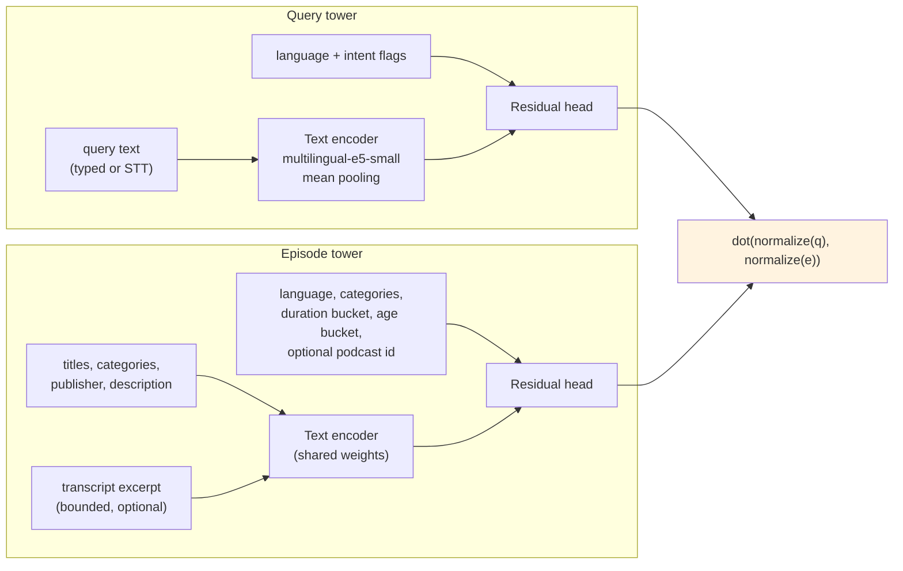
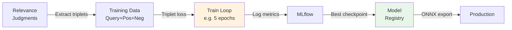
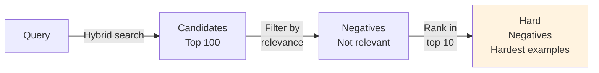

# Models: Training, Evaluation & Export

ML models power PodFind's semantic search and future reranking.

## Model Types

### Embedding Models (Current)

**Purpose**: Convert text to vectors for semantic search.  
**Current**: intfloat/multilingual-e5-small (384-dim)

See [05-embeddings.md](05-embeddings.md) for model details and inference strategy.

### Two-Tower Retrieval Model

**Purpose**: Fine-tuned semantic retrieval that must beat the pretrained
embedding baseline on the relevance set.
**Code**: `ml/models/two_tower/` (model), `ml/features/` (feature contract
and featurizer).



**Objective**: both towers emit unit vectors in one space; the score is
their dot product, and training divides it by a fixed temperature (0.05)
before the contrastive softmax.

**Design decisions:**

- **Shared text encoder.** One `multilingual-e5-small` backbone serves both
  towers (E5's `query:` / `passage:` prefixes keep the sides asymmetric).
  Separate encoders are a config switch, not the default: they double the
  parameters without adding data.
- **Starts at the baseline.** Each tower is `text_vector + head(features)`
  with the head's last layer zero-initialized, so an untrained model is
  *numerically identical* to the pretrained-embedding baseline (verified to
  1e-7 against `SentenceTransformer`). Fine-tuning can only move away from
  the baseline where the data justifies it, and any regression is a
  training effect, not an architecture artifact.
- **Bounded transcript pass.** Episodes with a transcript get a second
  encoder pass over its first ~2,000 characters (256 tokens); the rest get a
  zero vector plus a `has_transcript` flag. Only rows with transcripts are
  encoded, so the ~9% transcript coverage costs ~9% extra compute.
- **Structured features as embeddings.** Language, duration bucket, and
  publication-age bucket are learned embeddings; categories are the mean of
  learned category embeddings. Publication age is computed against a
  reference time the caller supplies (example event time in training,
  request time online) so both paths use one definition.
- **Learned podcast id, off by default.** A hashed podcast-id embedding is
  available for collaborative signal once interaction data exists; the
  bootstrap datasets have none, so it stays disabled.
- **Ablations are config switches.** `episode_text`, `use_transcript`,
  `use_structured`, `podcast_id_buckets`, `share_text_encoder`, and
  `query_context` in `TwoTowerConfig` produce the metadata-only,
  metadata+transcript, id-only, and combined variants from one code path.

**Feature contract** (`ml/features/contract.py`): the text model and its
prefixes, token budgets (64 query / 256 metadata / 256 transcript), the
language and category vocabularies built from a catalog snapshot, and the
duration and age bucket edges. It is saved with every model artifact and
fingerprinted (SHA-256); the featurizer is constructed from it, so training
and serving cannot compute features differently without changing the
fingerprint.

**Model artifact layout:**

```
<artifact>/
├── artifact.json           # architecture, embedding dim, parameter counts,
│                           # contract fingerprint, git revision, plus
│                           # training metadata (dataset version, metrics, use)
├── model_config.json       # TwoTowerConfig
├── feature_contract.json   # FeatureContract
├── backbone/config.json    # text-encoder architecture (no hub access to load)
├── tokenizer/              # the contract's tokenizer
└── weights.pt              # full state dict
```

`TwoTowerModel.load(dir)` and `Featurizer.load(dir)` rebuild both halves
from the directory alone.

**Measured** (laptop, Apple GPU, batch 64, untrained weights): ~216
episodes/s through the full episode tower including the transcript pass;
featurization ~5,000 rows/s. The median episode fills the 256-token
metadata budget, so descriptions are truncated for most of the catalog.

### Reranker Models (Future)

**Purpose**: Second-stage ranking to refine the fused candidate set. The
planned ranker is a gradient-boosted tree model over two-tower similarity,
lexical score and rank, exact-match indicators, freshness, popularity, and
candidate-source flags; a neural cross-encoder is a challenger that must
justify its latency, not the default.

### Popularity Models (Baseline)

**Purpose:** Simple baseline for ranking episodes by historical popularity.

**Computation:**
```python
# Per-episode popularity score
popularity = {
    'global': listen_count / max_listen_count,
    'by_category': category_listen_count / max_category_listen_count,
    'recency': 1.0 / (1.0 + days_since_published)
}
```

**Usage:** Separate retrieval system in pooling/evaluation.

## Model Training Workflow



### Training Steps

1. **Prepare**: Extract triplets from relevance judgments (positive/negative pairs)
2. **Train**: Contrastive loss on (query, positive episode, negative episode)
3. **Log**: MLflow tracks metrics, hyperparameters, best checkpoint
4. **Evaluate**: See [07-evaluation.md](07-evaluation.md)
5. **Export**: Save to ONNX for Go inference

**Run training:**
```bash
make train
```

### Two-Stage Ranking

```
Hybrid RRF (first-stage)
  ↓ Top 50 candidates
Reranker (second-stage)
  ↓ Re-score
Final ranking (top 10)
```

**Benefit**: Combines breadth (RRF finds diverse candidates) with depth (reranker refines).

## Hard Negatives

Hard negative mining creates challenging training examples.

**Why**: Random negatives are too easy to distinguish; model learns to overfit rather than generalize.

**Strategy**: Select negatives that rank highly in retrieval but are labeled as non-relevant.



**Intuition**: These episodes almost matched but were marked irrelevant—perfect for training discriminative models.

## Model Export & Serving

### Export Formats

| Format | Use Case |
|--------|----------|
| **PyTorch** | Training, fine-tuning |
| **ONNX** | Go inference (portable) |
| **TorchScript** | Python inference |
| **HuggingFace Hub** | Community sharing |

**Workflow**: Train in PyTorch → Export to ONNX → Deploy to Go → Log metrics to MLflow

### Model Registry (MLflow)

Register best checkpoint:
```
MLflow UI → Model Registry → Promote to Production → Serve
```

**Metadata**: Training dataset, git commit, validation metrics (recorded automatically)

## Model Versioning

**Scheme:**
```
reranker-e5small-2026-01-15-v1
       ↑base model    ↑date      ↑iteration
```

**Storage**: Checkpoint + metadata (training dataset, metrics, git commit)

## Best Practices

✓ **Version everything**: Checkpoints, configs, data versions  
✓ **Log to MLflow**: Metrics, hyperparameters, artifacts  
✓ **Evaluate before shipping**: Meet quality gates  
✓ **Reproducible**: Fixed seeds, documented hyperparameters  
✓ **Export for production**: ONNX for Go, TorchScript for Python  

✗ **No data leakage**: Train/val/test splits are separate  
✗ **Don't train on test set**: Use val set for tuning only
