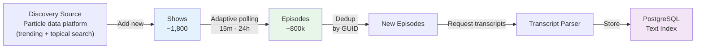

# Catalog: Ingestion, RSS Polling & Transcript Parsing

The catalog worker maintains a self-updating podcast feed, discovering new shows and episodes.

## Catalog Workflow



## Discovery: Finding New Shows

**Goal**: Continuously discover new podcast feeds.

**Source**: the [Particle data platform](https://docs.particle.pro) — daily
trending charts plus topical searches; RSS feed URLs come back with each
show and remain the authoritative source for episodes.

**Run discovery:**
```bash
docker compose run --rm catalog-worker -oneshot -trending 100
docker compose run --rm catalog-worker -oneshot -discover "machine learning"
```

## RSS Polling: Fetching Episodes

**Goal:** Periodically fetch new episodes from subscribed feeds.

> **Corpus freeze (since 2026-09-13):** the catalog worker is intentionally
> stopped (`docker compose stop catalog-worker`) to hold the evaluation
> corpus fixed at 795,533 episodes while baselines are compared. Resume
> ingestion with `docker compose start catalog-worker`; re-freeze the same
> way, and record the new date and episode count here and in the data card.

### Adaptive Polling Schedule

Don't poll all feeds equally; prioritize active shows:

```python
# Polling interval (hours) based on publish frequency
if show.episodes_per_week > 3:
    interval = 4  # Check every 4 hours
elif show.episodes_per_week > 1:
    interval = 12  # Check twice daily
else:
    interval = 48  # Check every 2 days
```

### Polling Worker

```go
// cmd/catalog-worker/main.go
func pollFeeds(ctx context.Context, db *postgres.DB) error {
    shows, err := db.ShowsNeedingPoll(ctx)  // Shows not polled in X hours
    if err != nil {
        return err
    }
    
    for _, show := range shows {
        feed, err := fetchRSSFeed(show.RSSURL)
        if err != nil {
            log.Warnf("Failed to fetch feed %s: %v", show.RSSURL, err)
            continue
        }
        
        // Extract episodes
        episodes := parseEpisodes(feed)
        
        // Deduplicate against existing
        newEpisodes := deduplicateEpisodes(episodes, show.ID, db)
        
        // Insert new episodes
        if err := db.InsertEpisodes(ctx, newEpisodes); err != nil {
            log.Errorf("Failed to insert episodes for show %d: %v", show.ID, err)
            continue
        }
        
        // Mark feed as polled
        db.UpdateShowLastPolled(ctx, show.ID)
    }
    
    return nil
}
```

**Run polling:**
```go
// Run continuously as background job
ticker := time.NewTicker(10 * time.Minute)
for range ticker.C {
    pollFeeds(ctx, db)
}
```

## Deduplication

Episodes can appear multiple times across feeds:
1. Same episode in multiple podcast feeds (cross-posting)
2. Same RSS feed URL with different domains
3. Duplicate episodes (reissues, reruns)

### Dedup Strategy

```go
type EpisodeKey struct {
    GUID        string  // RSS <guid>
    EnclosureURL string  // RSS <enclosure url>
}

func deduplicateEpisodes(episodes []RSSItem, showID int64, db *postgres.DB) []Episode {
    deduped := make([]Episode, 0)
    seenKeys := make(map[EpisodeKey]bool)
    
    // Check against existing episodes
    for _, item := range episodes {
        key := EpisodeKey{
            GUID:        item.GUID,
            EnclosureURL: item.Enclosure.URL,
        }
        
        // Already seen in this feed
        if seenKeys[key] {
            continue
        }
        seenKeys[key] = true
        
        // Check database
        existing, _ := db.FindEpisodeByGUID(item.GUID)
        if existing != nil {
            continue  // Already in catalog
        }
        
        // New episode
        deduped = append(deduped, Episode{
            ShowID:  showID,
            GUID:    item.GUID,
            Title:   item.Title,
            Desc:    item.Description,
            PubDate: parseDate(item.PubDate),
            URL:     item.Enclosure.URL,
        })
    }
    
    return deduped
}
```

## RSS Parsing

### Feed Format Support

- **Apple Podcasts:** Standard RSS with iTunes extensions
- **Podbean:** Custom extensions for metadata
- **Transistor, Podpage:** Standard RSS
- **Transcript sources:** Podtrac, Panoply, Rev, etc.

### Parsing Logic

```go
// internal/rss/parser.go
func parseRSSFeed(xmlData []byte) (*Feed, error) {
    var rss RSSFeed
    err := xml.Unmarshal(xmlData, &rss)
    if err != nil {
        return nil, err
    }
    
    feed := &Feed{
        Title:       rss.Channel.Title,
        Description: rss.Channel.Description,
        Language:    rss.Channel.Language,
        Category:    rss.Channel.iTunes.Category.Text,
        Episodes:    make([]Episode, 0),
    }
    
    for _, item := range rss.Channel.Items {
        ep := Episode{
            GUID:        item.GUID,
            Title:       item.Title,
            Description: item.Description,
            PubDate:     parseRFC2822(item.PubDate),
            
            // iTunes extensions
            Duration:    parseDuration(item.iTunes.Duration),
            Explicit:    item.iTunes.Explicit == "yes",
            
            // Enclosure (audio file)
            URL:         item.Enclosure.URL,
            Type:        item.Enclosure.Type,
        }
        
        feed.Episodes = append(feed.Episodes, ep)
    }
    
    return feed, nil
}
```

## Transcript Parsing

### Transcript Sources

- **Podtrac**: XML format, time-aligned
- **Rev**: VTT (WebVTT) format
- **Transistor**: Imported transcripts
- **User-provided**: Upload or link to transcript

### Parsing & Storage

```go
// internal/transcript/parser.go
func ParseTranscript(episodeID int64, transcriptURL string) (string, error) {
    // Fetch transcript
    resp, err := http.Get(transcriptURL)
    if err != nil {
        return "", err
    }
    defer resp.Body.Close()
    
    // Detect format
    contentType := resp.Header.Get("Content-Type")
    
    var text string
    switch {
    case strings.Contains(contentType, "xml"):
        text, _ = parsePodtracXML(resp.Body)
    case strings.Contains(contentType, "vtt"):
        text, _ = parseWebVTT(resp.Body)
    default:
        text, _ = parsePlainText(resp.Body)
    }
    
    // Store in PostgreSQL
    _, err = db.Exec(
        "UPDATE episodes SET transcript = $1, transcript_source = $2 WHERE id = $3",
        text, transcriptURL, episodeID,
    )
    
    return text, err
}
```

## Catalog Schema

```sql
CREATE TABLE shows (
    id BIGINT PRIMARY KEY GENERATED ALWAYS AS IDENTITY,
    title VARCHAR(500) NOT NULL,
    rss_url VARCHAR(2048) UNIQUE NOT NULL,
    description TEXT,
    language VARCHAR(5),
    category VARCHAR(100),
    artwork_url VARCHAR(2048),
    
    -- Polling
    last_polled_at TIMESTAMP,
    polling_interval_hours INT DEFAULT 24,
    poll_error_count INT DEFAULT 0,
    
    -- Metadata
    created_at TIMESTAMP DEFAULT NOW(),
    updated_at TIMESTAMP DEFAULT NOW()
);

CREATE TABLE episodes (
    id BIGINT PRIMARY KEY GENERATED ALWAYS AS IDENTITY,
    show_id BIGINT NOT NULL REFERENCES shows(id),
    guid VARCHAR(1024) UNIQUE NOT NULL,
    title VARCHAR(500) NOT NULL,
    description TEXT,
    transcript TEXT,
    
    -- Audio metadata
    duration_seconds INT,
    explicit BOOLEAN DEFAULT FALSE,
    enclosure_url VARCHAR(2048),
    
    -- Timestamps
    published_at TIMESTAMP NOT NULL,
    created_at TIMESTAMP DEFAULT NOW(),
    
    -- Search indices
    tsv TSVECTOR,
    embedding vector(384),  -- Filled by embedding worker
    
    -- Dedup
    guid_or_enclosure_url VARCHAR(1024)  -- For fallback dedup
);

-- Indices
CREATE INDEX ON episodes (show_id, published_at DESC);
CREATE INDEX ON episodes USING GIN(tsv);  -- Full-text search
CREATE INDEX ON episodes USING HNSW(embedding);  -- Vector search
```

## Error Handling & Recovery

### Feed Fetch Failures

```go
// Retry with exponential backoff
retries := 0
maxRetries := 3
backoff := 5 * time.Second

for retries < maxRetries {
    err := fetchRSSFeed(feedURL)
    if err == nil {
        break
    }
    
    retries++
    time.Sleep(backoff)
    backoff *= 2
}

if retries == maxRetries {
    // Mark feed as inactive
    db.InactivateShow(feedID)
    alertOperator("Feed fetch failed", feedURL)
}
```

### Transcript Parsing Failures

```go
// Log failure but don't block feed updates
if err := parseTranscript(episodeID, transcriptURL); err != nil {
    log.Warnf("Failed to parse transcript for episode %d: %v", episodeID, err)
    
    // Record error for monitoring
    db.LogError("transcript_parse", episodeID, err.Error())
    
    // Continue with episode (transcript is optional)
}
```

## Monitoring & Observability

Track catalog health:

```
catalog_shows_total{active="true"}  # Currently active shows
catalog_episodes_total              # Total episodes in catalog
catalog_poll_duration_seconds       # Time to poll all feeds
catalog_new_episodes_daily          # New episodes discovered
catalog_transcript_coverage         # % episodes with transcripts
catalog_poll_errors_total           # Failed polls
catalog_dedup_rate                  # Ratio of duplicates to unique
```

See [12-observability.md](12-observability.md) for monitoring setup.

## Maintenance Tasks

### Cleanup

```bash
# Remove inactive shows (no new episodes in 1 year)
DELETE FROM shows WHERE last_polled_at < NOW() - INTERVAL '1 year';

# Archive old episodes (keep recent 2 years for search)
DELETE FROM episodes WHERE published_at < NOW() - INTERVAL '2 years';
```

### Integrity Checks

```sql
-- Find episodes without shows
SELECT COUNT(*) FROM episodes WHERE show_id NOT IN (SELECT id FROM shows);

-- Find missing transcripts for high-popularity episodes
SELECT COUNT(*) FROM episodes 
WHERE transcript IS NULL AND listen_count > 1000;
```

## Future Enhancements

1. **Podcast discovery API**: Expose new shows via API
2. **Feed subscription management**: UI to subscribe/unsubscribe feeds
3. **Transcript quality scoring**: Prefer high-quality sources
4. **Automatic feed splitting**: If podcast feed contains multiple shows
5. **Feed health monitoring**: Alert on stale/dead feeds
